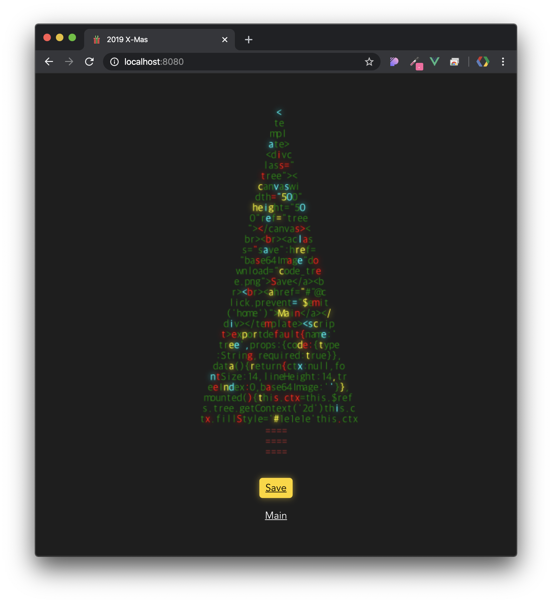
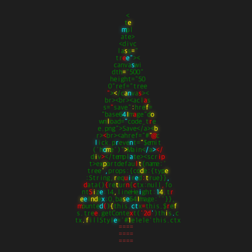

# 2019-x-mas

🎄 Merry X mas!

[링크](https://leegeunhyeok.github.io/2019-x-mas)

> 여러분의 코드를 아름다운 트리로 만들어드립니다!





- 결과물은 이미지로 다운로드 받으실 수 있어요!

## Project setup
```
npm install
```

### Compiles and hot-reloads for development
```
npm run serve
```

### Compiles and minifies for production
```
npm run build
```

### Lints and fixes files
```
npm run lint
```

### Customize configuration
See [Configuration Reference](https://cli.vuejs.org/config/).

## 정보

### 아이콘

[여기](https://deszone.net/item/christmas-vector-free-icon-set)에서 제공한 아이콘을 사용했습니다.
